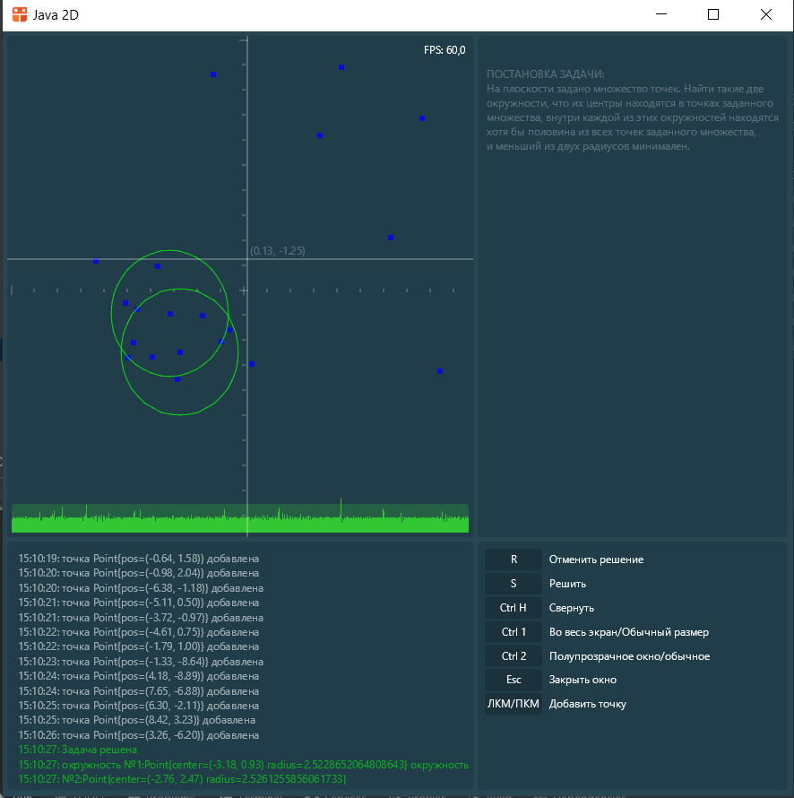

# Проект по информатике

-----

### Чашин Андрей Евгеньевич 10-1

###### Задача №28

На плоскости задано множество точек. Найти такие две окружности, что их центры находятся в точках 
заданного множества, внутри каждой из этих окружностей находятся хотя бы половина из всех точек 
заданного множества, и меньший из двух радиусов минимален.

